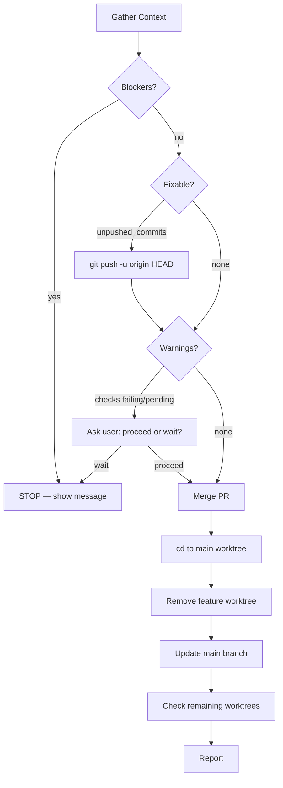

---
description:
  Squash-merge the current branch's PR, clean up the worktree, return to main,
  and report remaining worktree status
disable-model-invocation: true
allowed-tools:
  - Read
  - Bash(git *)
  - Bash(gh *)
  - Bash(cd *)
  - Bash(pwd)
---

# Merge Worktree

## Overview

Automates the end-of-feature cleanup: squash-merge the PR, remove the worktree,
update main, and report remaining worktree status.

**Announce at start:** "I'm using the merge-worktree skill to squash-merge and
clean up."

## Decision Flowchart



## Step 1: Gather Context

Run each command and save the result into the indicated variable.

### 1a. Current working directory

```bash
pwd
```

Save as `WORKTREE_PATH`.

### 1b. Current branch

```bash
git branch --show-current
```

Save as `CURRENT_BRANCH`. If empty, STOP — detached HEAD state.

### 1c. Worktree list

```bash
git worktree list --porcelain
```

Parse the porcelain output. Each worktree block has `worktree <path>` and
`branch refs/heads/<name>` lines separated by blank lines. The **first entry**
is always the main worktree. Save its path as `MAIN_WORKTREE_PATH`.

### 1d. Detect main worktree

If `WORKTREE_PATH` equals `MAIN_WORKTREE_PATH`, this is the main worktree —
record `IN_MAIN_WORKTREE = true`.

### 1e. Default branch

```bash
gh repo view --json defaultBranchRef -q '.defaultBranchRef.name'
```

Save as `DEFAULT_BRANCH`. Falls back to `main` if empty.

### 1f. Uncommitted changes

```bash
git status --porcelain
```

If output is non-empty, record `HAS_UNCOMMITTED_CHANGES = true`.

### 1g. Unpushed commits

```bash
git rev-parse @{u}
```

If this fails (exit code non-zero), the branch has **no upstream** — record
`HAS_UNPUSHED_COMMITS = true`.

If it succeeds, check:

```bash
git rev-list @{u}..HEAD
```

If output is non-empty, record `HAS_UNPUSHED_COMMITS = true`.

### 1h. PR status

```bash
gh pr view --json number,url,state,title,mergeable,statusCheckRollup
```

If this fails or returns empty, record `NO_PR = true`. Otherwise parse the JSON
and save as `PR_INFO`. Extract:

- `PR_STATE` = `.state`
- `PR_MERGEABLE` = `.mergeable`
- `CHECK_STATES` = for each entry in `.statusCheckRollup`, take `.conclusion`
  (or `.state` if conclusion is null)

## Step 2: Check Preconditions

Evaluate all gathered context against the tables below. Process **all blockers
first**, then fixable, then warnings.

### Blockers — STOP immediately

| Condition | Message |
|---|---|
| `CURRENT_BRANCH == DEFAULT_BRANCH` | Currently on `{DEFAULT_BRANCH}`. Nothing to merge. |
| `IN_MAIN_WORKTREE` | Must run from a feature worktree, not the main worktree. |
| `HAS_UNCOMMITTED_CHANGES` | Uncommitted changes detected. Commit or stash before merging. |
| `NO_PR` | No pull request found for this branch. |
| `PR_STATE != "OPEN"` | PR is `{PR_STATE}`, not OPEN. |
| `PR_MERGEABLE == "CONFLICTING"` | PR has merge conflicts that must be resolved first. |

If **any** blocker is true, STOP. Show all blocker messages to the user and
abort.

### Fixable — handle automatically

| Condition | Action |
|---|---|
| `HAS_UNPUSHED_COMMITS` | Run `git push -u origin HEAD`, then continue. |

### Warnings — ask the user

| Condition | Message |
|---|---|
| Any `CHECK_STATES` contains `FAILURE` | Some status checks are failing. Proceed anyway? |
| Any `CHECK_STATES` contains `PENDING`, `QUEUED`, `IN_PROGRESS`, or empty string | Some status checks are still running. Proceed or wait? |

If the user chooses to wait, STOP.

## Step 3: Merge

```bash
gh pr merge --squash --delete-branch
```

If this fails, STOP and show the error output to the user.

## Step 4: cd to main worktree

```bash
cd {MAIN_WORKTREE_PATH}
```

## Step 5: Remove feature worktree

Remove the worktree, prune stale entries, and delete the local branch.
Tolerate errors on each command — the branch or directory may already be gone.

```bash
git worktree remove --force {WORKTREE_PATH}
```

```bash
git worktree prune
```

```bash
git branch -D {CURRENT_BRANCH}
```

## Step 6: Update main

```bash
git fetch --prune
```

```bash
git pull --ff-only
```

If `pull --ff-only` fails, inform the user that main couldn't be fast-forwarded
(likely diverged) but continue to the report step.

## Step 7: Check remaining worktrees

```bash
git worktree list --porcelain
```

For each non-main worktree, extract its branch name and check if the remote
branch still exists:

```bash
git ls-remote --heads origin {BRANCH}
```

- **Stale**: remote branch does not exist (empty output) — the PR was likely
  merged or the branch was deleted.
- **Active**: remote branch still exists.

## Step 8: Report

Summarize:

- PR was squash-merged
- Worktree `{WORKTREE_PATH}` was removed
- Main branch was updated (or note if ff-only failed)

**If stale worktrees exist:** list them with path and branch, then ask the user
if they want to remove any. For each one the user confirms, run:

```bash
git worktree remove --force {STALE_PATH}
git worktree prune
git branch -D {STALE_BRANCH}
```

**If active worktrees exist:** list them for awareness (no action needed).

**If no other worktrees exist:** note that all worktrees are cleaned up.

## Quick Reference

| Situation | Action |
|---|---|
| Blocker found | STOP with message |
| Unpushed commits | Push automatically, then continue |
| Checks failing/pending | Inform user, ask to proceed or wait |
| Merge fails | STOP with error |
| ff-only pull fails | Warn but continue to report |
| Stale worktrees found | List and offer to clean up |
| Active worktrees found | List for awareness |

## Red Flags

**Never:**

- Skip the gather context / precondition steps
- Force-merge a PR with merge conflicts
- Remove a worktree without merging first
- Delete worktrees the user didn't confirm

**Always:**

- Check all preconditions before merging
- Handle all blockers before proceeding
- Confirm with user on warnings (failing/pending checks)
- Use `cd` to switch to main worktree before removing the feature worktree
- Tolerate errors during cleanup (worktree remove, branch delete) — they may already be gone
