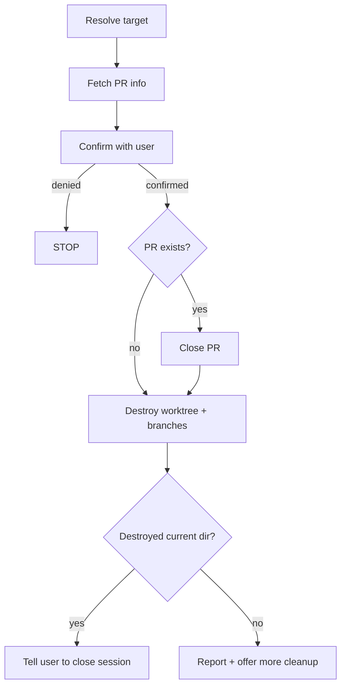

---
description:
  Destroy a worktree — close any PR, delete local and remote branches,
  and remove the worktree, discarding all uncommitted changes.
  Optionally takes a branch name argument; defaults to the current worktree.
disable-model-invocation: true
allowed-tools:
  - AskUserQuestion
  - Bash(git *)
  - Bash(gh *)
---

# Destroy Worktree

**Announce at start:** "I'm using the wt-destroy skill to tear down a
worktree."

## Context

- **Current directory:** !`pwd`
- **Current branch:** !`git branch --show-current`
- **Worktrees:** !`git worktree list --porcelain`
- **Working tree status:** !`git status --porcelain`
- **PR info:** !`gh pr view --json number,url,state,title 2>&1 || echo NO_PR`

## Decision Flowchart



## Preconditions

| Check | How to detect | Action |
|---|---|---|
| Target is the main worktree | Target path matches the first entry in the worktree list | STOP — tell user this is the main worktree |
| Branch argument doesn't match any worktree | No worktree entry has the given branch | STOP — tell user the branch was not found in the worktree list |

Uncommitted changes do NOT block execution — they are discarded.

## Variables

| Variable | Source |
|---|---|
| `{BRANCH}` | The skill argument if provided, otherwise the current branch |
| `{MAIN_WORKTREE}` | Path of the first entry in the worktree list (the main worktree) |
| `{WORKTREE_PATH}` | Worktree path matching `{BRANCH}` from the worktree list |
| `{NUMBER}` | PR number — from Step 2 if argument provided, from `!` context otherwise |
| `{DESTROYING_SELF}` | `true` if current directory == `{WORKTREE_PATH}`, `false` otherwise |

If a branch name argument was provided, look up `{WORKTREE_PATH}` from the
worktree list by matching the `branch` field. If no argument, use the current
directory for `{WORKTREE_PATH}` and the current branch for `{BRANCH}`.

## Steps

### Step 1: Resolve target

Determine `{BRANCH}`, `{WORKTREE_PATH}`, and `{DESTROYING_SELF}` from the
argument or current directory (see Variables above). Check preconditions and
STOP if they fail.

### Step 2: Fetch PR info (if argument provided)

Skip this step if no argument was provided — the `!` context already has PR info
for the current branch.

```bash
gh pr view {BRANCH} --json number,url,state,title 2>/dev/null || echo NO_PR
```

This fetches PR info for the target branch (which differs from the current
branch). Save the result for use in Steps 3 and 4.

### Step 3: Confirm

Use `AskUserQuestion` to confirm destruction. Include in the question:

- Branch name: `{BRANCH}`
- Worktree path: `{WORKTREE_PATH}`
- PR: title and number if exists, or "no associated PR"

Example: "Destroy worktree for branch `fix-foo` at `/path/to/fix-foo`? This will
close PR #42 'Fix foo' and delete the local and remote branches."

If the user denies, STOP.

### Step 4: Close PR (if applicable)

Skip this step if PR info shows `NO_PR` or the PR state is not `OPEN`.

```bash
gh pr close {NUMBER}
```

Tolerate errors — the PR may have already been closed or merged.

### Step 5: Destroy + cleanup

**CRITICAL:** This MUST be a **single Bash invocation**. If `{DESTROYING_SELF}`
is true, the shell's CWD will no longer exist after `worktree remove` and ALL
subsequent Bash tool calls will fail. Every command uses `git -C` to operate from
{MAIN_WORKTREE} regardless of the shell's CWD state.

Do NOT split these into separate Bash calls. Do NOT remove or reorder commands.

```bash
git -C {MAIN_WORKTREE} worktree remove --force {WORKTREE_PATH}; git -C {MAIN_WORKTREE} worktree prune; git -C {MAIN_WORKTREE} branch -D {BRANCH} 2>/dev/null; git -C {MAIN_WORKTREE} push origin --delete {BRANCH} 2>/dev/null; echo "===REMAINING WORKTREES==="; git -C {MAIN_WORKTREE} worktree list
```

Commands are joined with `;` (continue regardless of errors). Individual failures
are tolerated — the branch or remote may already be gone.

### Step 6: Report

Parse the output from Step 5. Everything after `===REMAINING WORKTREES===` is
the current worktree list.

**If `{DESTROYING_SELF}` is true:**

Summarize what was destroyed:
- Worktree removed, PR closed (if applicable), branches deleted

Then tell the user: **"The current directory has been deleted. Please close this
session and open a new one from a valid directory."**

Do NOT run any further Bash commands or offer follow-up actions — the shell is
broken.

**If `{DESTROYING_SELF}` is false:**

Summarize what was destroyed:
- Worktree removed, PR closed (if applicable), branches deleted

List remaining worktrees. If any look stale (e.g. branch no longer exists on
remote), offer to destroy them.

## Red Flags

**Never:**

- Run this on the main worktree
- Skip the confirmation step
- Split Step 5 into multiple Bash calls
- Run Bash commands after destroying the current worktree (`{DESTROYING_SELF}` = true)

**Always:**

- Use `git -C {MAIN_WORKTREE}` for all git commands (never `cd`)
- Keep all post-close operations in a single Bash invocation
- Tolerate errors during cleanup (worktree remove, branch delete, remote delete)
- Close the PR before destroying the worktree
