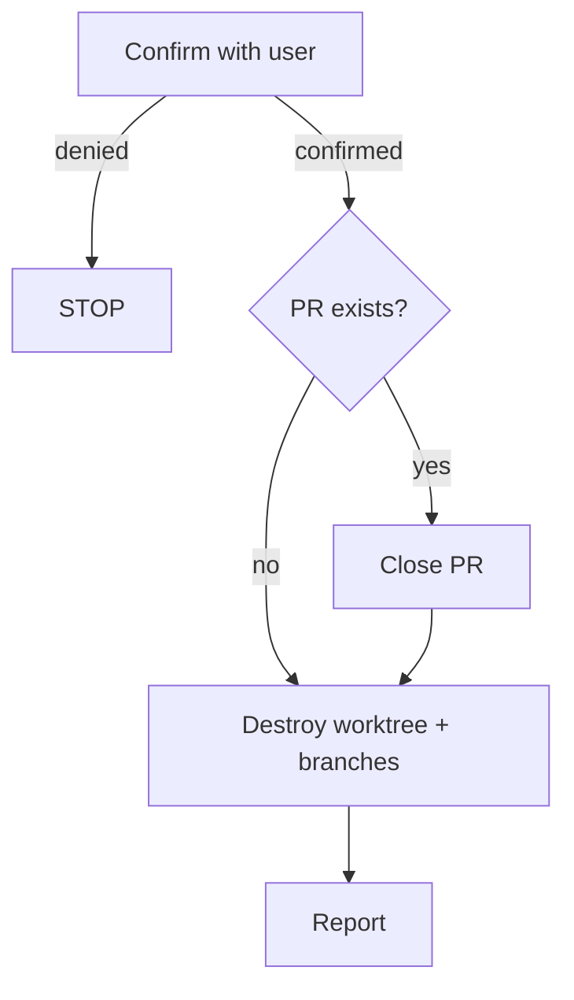

---
description:
  Destroy a worktree — close any PR, delete local and remote branches,
  and remove the worktree, discarding all uncommitted changes
disable-model-invocation: true
allowed-tools:
  - AskUserQuestion
  - Bash(git *)
  - Bash(gh *)
---

# Destroy Worktree

**Announce at start:** "I'm using the wt-destroy skill to tear down this
worktree."

## Context

- **Current directory:** !`pwd`
- **Current branch:** !`git branch --show-current`
- **Worktrees:** !`git worktree list --porcelain`
- **Working tree status:** !`git status --porcelain`
- **PR info:** !`gh pr view --json number,url,state,title 2>&1 || echo NO_PR`

## Decision Flowchart



## Precondition

| Check | How to detect | Action |
|---|---|---|
| Not in a worktree | Worktree list has only one entry (the current directory is the main worktree) | STOP — tell user this is the main worktree, not a feature worktree |

Uncommitted changes do NOT block execution — they are discarded.

## Variables

Extract from context above:

| Variable | Source |
|---|---|
| `{BRANCH}` | Current branch name |
| `{MAIN_WORKTREE}` | Path of the first entry in the worktree list (the main worktree) |
| `{WORKTREE_PATH}` | Current directory (the feature worktree being destroyed) |
| `{NUMBER}` | PR number from PR info (may be absent if NO_PR) |

## Steps

### Step 1: Confirm

Use `AskUserQuestion` to confirm destruction. Include in the question:

- Branch name: `{BRANCH}`
- Uncommitted changes: count of lines from working tree status (or "none")
- PR: title and number if exists, or "no PR"

Example: "Destroy worktree for branch `fix-foo`? This will discard 3 uncommitted
changes, close PR #42 'Fix foo', and delete the local and remote branches."

If the user denies, STOP.

### Step 2: Close PR (if applicable)

Skip this step if PR info shows `NO_PR` or the PR state is not `OPEN`.

```bash
gh pr close {NUMBER}
```

Tolerate errors — the PR may have already been closed or merged.

### Step 3: Destroy + cleanup

**CRITICAL:** This MUST be a **single Bash invocation**. After `worktree remove`
deletes {WORKTREE_PATH}, the shell's CWD no longer exists and ALL subsequent
Bash tool calls will fail. Every command uses `git -C` to operate from
{MAIN_WORKTREE} regardless of the shell's CWD state.

Do NOT split these into separate Bash calls. Do NOT remove or reorder commands.

```bash
git -C {MAIN_WORKTREE} worktree remove --force {WORKTREE_PATH}; git -C {MAIN_WORKTREE} worktree prune; git -C {MAIN_WORKTREE} branch -D {BRANCH} 2>/dev/null; git -C {MAIN_WORKTREE} push origin --delete {BRANCH} 2>/dev/null; echo "===REMAINING WORKTREES==="; git -C {MAIN_WORKTREE} worktree list
```

Commands are joined with `;` (continue regardless of errors). Individual failures
are tolerated — the branch or remote may already be gone.

### Step 4: Report

Parse the output from Step 3. Everything after `===REMAINING WORKTREES===` is
the current worktree list.

Summarize:

- Worktree was destroyed
- PR was closed (if applicable, include title and URL from context)
- Local and remote branches were deleted
- Any errors from Step 3 output (e.g. remote branch didn't exist)

List remaining worktrees.

## Red Flags

**Never:**

- Run this on the main worktree
- Skip the confirmation step
- Split Step 3 into multiple Bash calls

**Always:**

- Use `git -C {MAIN_WORKTREE}` for all git commands (never `cd`)
- Keep all post-close operations in a single Bash invocation
- Tolerate errors during cleanup (worktree remove, branch delete, remote delete)
- Close the PR before destroying the worktree
