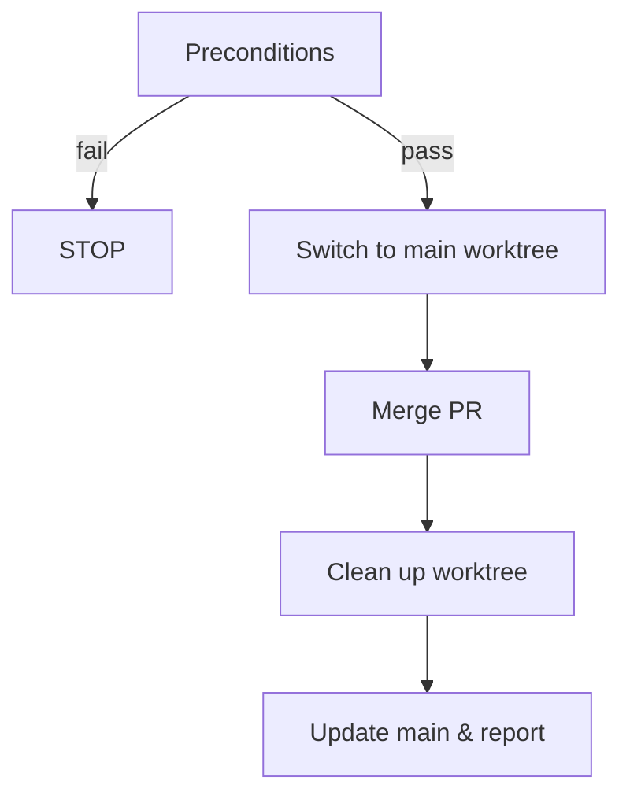

---
description:
  Squash-merge the current branch's PR, clean up the worktree, return to main,
  and report remaining worktree status
disable-model-invocation: true
allowed-tools:
  - AskUserQuestion
  - Bash(git *)
  - Bash(gh *)
  - Bash(cd *)
  - Bash(pwd)
---

# Merge Worktree

**Announce at start:** "I'm using the wt-merge skill to squash-merge and
clean up."

## Context

- **Current directory:** !`pwd`
- **Current branch:** !`git branch --show-current`
- **Worktrees:** !`git worktree list --porcelain`
- **Working tree status:** !`git status --porcelain`
- **Unpushed commits:** !`git rev-list @{u}..HEAD 2>/dev/null || echo NO_UPSTREAM`
- **PR info:** !`gh pr view --json number,url,state,title 2>&1 || echo NO_PR`

## Decision Flowchart



## Preconditions

Only two checks before proceeding — everything else fails naturally with clear
errors from `gh pr merge`.

| Check | How to detect | Action |
|---|---|---|
| Uncommitted changes | Working tree status is non-empty | STOP — tell user to commit or stash |
| Unpushed commits | Output shows commit SHAs or `NO_UPSTREAM` | Run `git push -u origin HEAD`, then continue |

## Steps

### Step 1: Switch to main worktree

`cd` to the main worktree (first entry in the worktree list above). This MUST be
a **standalone Bash call** — never chain it with `&&` or other commands. The Bash
tool validates CWD before each invocation, so the `cd` must complete on its own
to update the working directory for subsequent calls.

```bash
cd {MAIN_WORKTREE}
```

### Step 2: Merge

```bash
gh pr merge {NUMBER} --squash
```

Use the PR number from context — do NOT use `--delete-branch` (it tries to
switch branches locally, which fails when `main` is already checked out in
another worktree). Branch cleanup is handled in Step 3.

If this fails, STOP and show the error to the user. The error message from `gh`
is self-explanatory (no PR, PR closed, merge conflicts, checks failing, etc.).

### Step 3: Clean up worktree

Already in the main worktree from Step 1.

```bash
git worktree remove --force {WORKTREE_PATH}
```

```bash
git worktree prune
```

```bash
git branch -D {BRANCH}
```

Tolerate errors on each command — the branch or directory may already be gone.

### Step 4: Update main

```bash
git fetch --prune && git pull --ff-only
```

If `pull --ff-only` fails, warn the user but continue to the report.

### Step 5: Report

Summarize:

- PR was squash-merged (include title and URL from context)
- Worktree was removed
- Main branch was updated (or note if ff-only failed)

List remaining worktrees from `git worktree list`. If any look stale (e.g.
branch no longer exists on remote), offer to clean them up.

## Red Flags

**Never:**

- Remove a worktree without merging first
- Delete worktrees the user didn't confirm

**Always:**

- Use `cd` to switch to main worktree before removing the feature worktree
- Tolerate errors during cleanup (worktree remove, branch delete)
