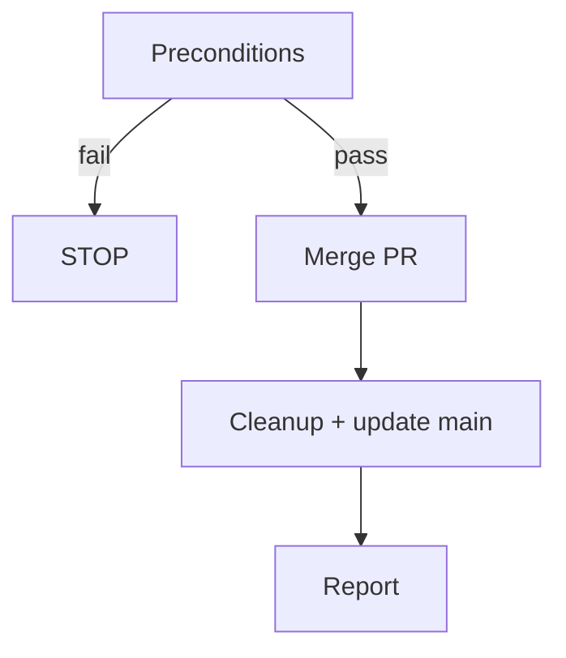

---
description:
  Squash-merge the current branch's PR, clean up the worktree, return to main,
  and report remaining worktree status
disable-model-invocation: true
allowed-tools:
  - AskUserQuestion
  - Bash(git *)
  - Bash(gh *)
---

# Merge Worktree

**Announce at start:** "I'm using the wt-merge skill to squash-merge and
clean up."

## Context

- **Current directory:** !`pwd`
- **Current branch:** !`git branch --show-current`
- **Worktrees:** !`git worktree list --porcelain`
- **Working tree status:** !`git status --porcelain`
- **Unpushed commits:** !`git rev-list @{u}..HEAD 2>/dev/null || echo NO_UPSTREAM`
- **PR info:** !`gh pr view --json number,url,state,title 2>&1 || echo NO_PR`

## Decision Flowchart



## Preconditions

Only two checks before proceeding — everything else fails naturally with clear
errors from `gh pr merge`.

| Check | How to detect | Action |
|---|---|---|
| Uncommitted changes | Working tree status is non-empty | STOP — tell user to commit or stash |
| Unpushed commits | Output shows commit SHAs or `NO_UPSTREAM` | Run `git push -u origin HEAD`, then continue |

## Variables

Extract from context above:

| Variable | Source |
|---|---|
| `{NUMBER}` | PR number from PR info |
| `{MAIN_WORKTREE}` | Path of the first entry in the worktree list (the main worktree) |
| `{WORKTREE_PATH}` | Current directory (the feature worktree being removed) |
| `{BRANCH}` | Current branch name |

## Steps

### Step 1: Merge

```bash
gh pr merge {NUMBER} --squash
```

Use the PR number from context. Do NOT use `--delete-branch` (it tries to switch
branches locally, which fails when the default branch is already checked out in
the main worktree). Branch cleanup is handled in Step 2.

If this fails, STOP and show the error to the user.

### Step 2: Cleanup + update main

**CRITICAL:** This MUST be a **single Bash invocation**. After `worktree remove`
deletes {WORKTREE_PATH}, the shell's CWD no longer exists and ALL subsequent
Bash tool calls will fail. Every command uses `git -C` to operate from
{MAIN_WORKTREE} regardless of the shell's CWD state.

Do NOT split these into separate Bash calls. Do NOT remove or reorder commands.

```bash
git -C {MAIN_WORKTREE} worktree remove --force {WORKTREE_PATH}; git -C {MAIN_WORKTREE} worktree prune; git -C {MAIN_WORKTREE} branch -D {BRANCH} 2>/dev/null; git -C {MAIN_WORKTREE} fetch --prune && git -C {MAIN_WORKTREE} pull --ff-only; echo "===REMAINING WORKTREES==="; git -C {MAIN_WORKTREE} worktree list
```

Commands are joined with `;` (continue regardless of errors) except `fetch && pull`
which are dependent. Individual failures are tolerated — the branch or worktree
directory may already be gone.

### Step 3: Report

Parse the output from Step 2. Everything after `===REMAINING WORKTREES===` is
the current worktree list.

Summarize:

- PR was squash-merged (include title and URL from context)
- Worktree was removed
- Main branch was updated (or note if ff-only failed based on Step 2 output)

List remaining worktrees. If any look stale (e.g. branch no longer exists on
remote), offer to clean them up.

## Red Flags

**Never:**

- Remove a worktree without merging first
- Delete worktrees the user didn't confirm
- Split Step 2 into multiple Bash calls

**Always:**

- Use `git -C {MAIN_WORKTREE}` for all git commands (never `cd`)
- Keep all post-merge operations in a single Bash invocation
- Tolerate errors during cleanup (worktree remove, branch delete)
